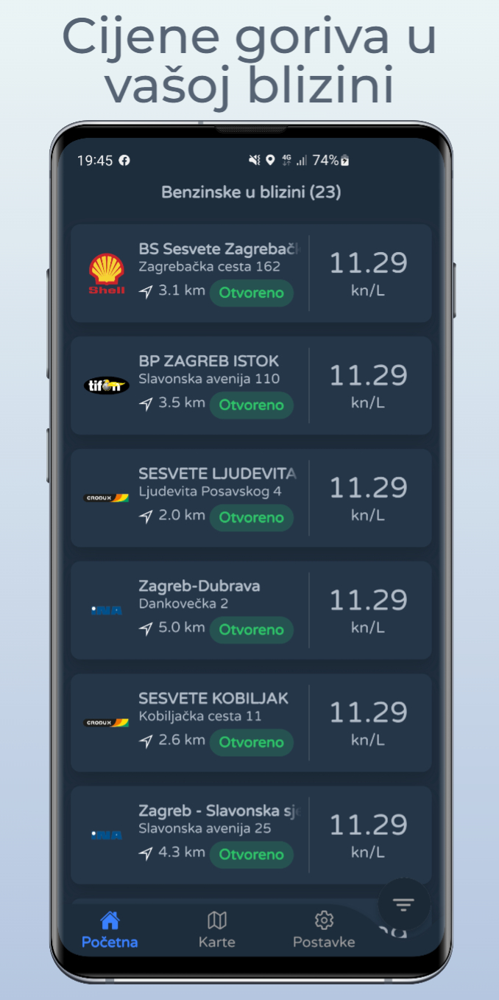
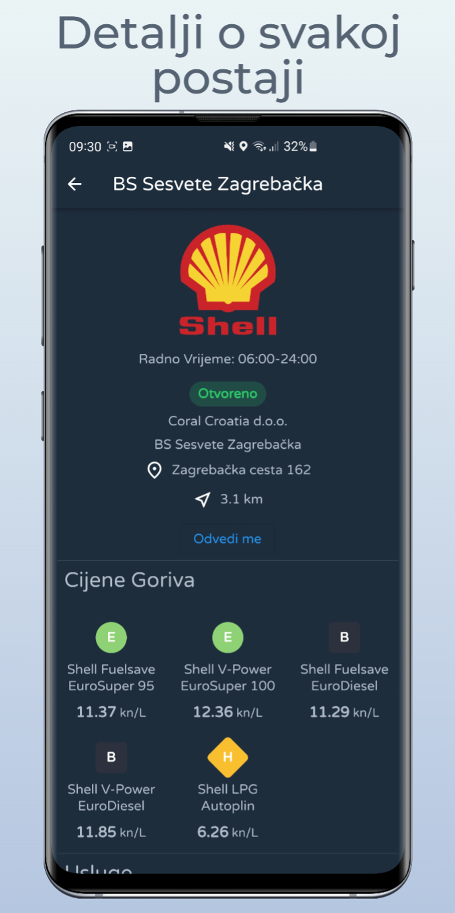
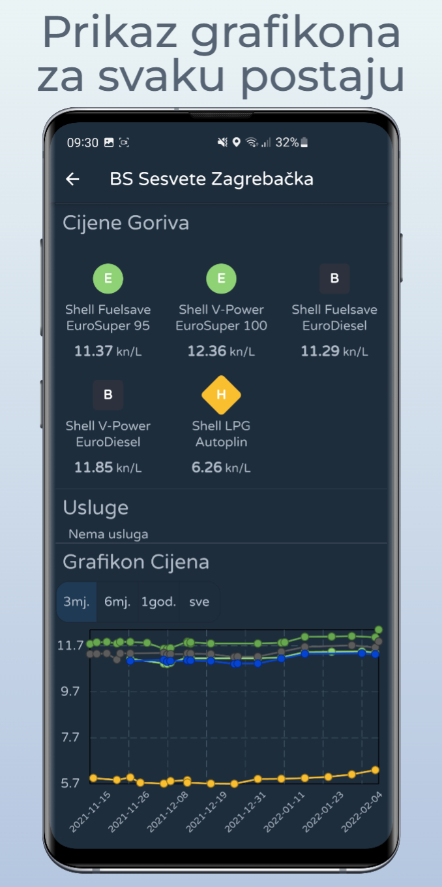
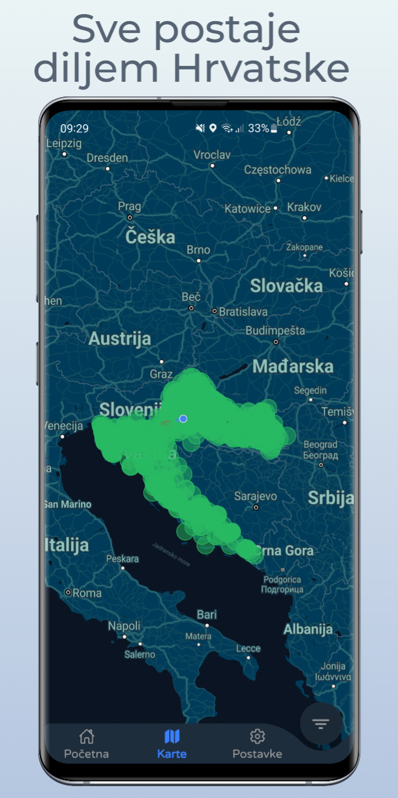
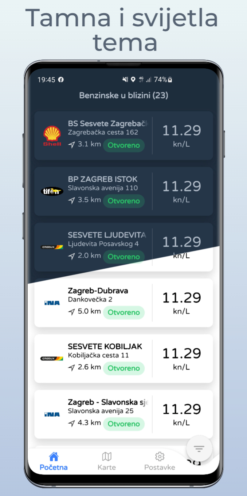

Jednostavna aplikacija napravljena u Flutter-u za prikazivanje benzinskih postaji u Republici Hrvatskoj.

## Slike zaslona

## Opis
Aplikacija koristi [MZOE](https://mzoe-gor.hr/) stranicu za preuzimanje podataka, te aplikacija koristi vašu trenutnu lokaciju da pronađe benzinske postaje u blizini vas. Mogućnost traženja i filtiranje benzinskih postaji po:
* Udaljenosti
* Cijeni goriva
* Vrsta goriva